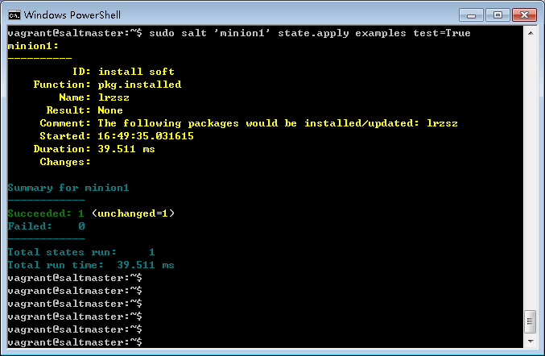
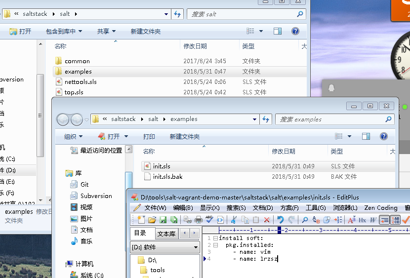
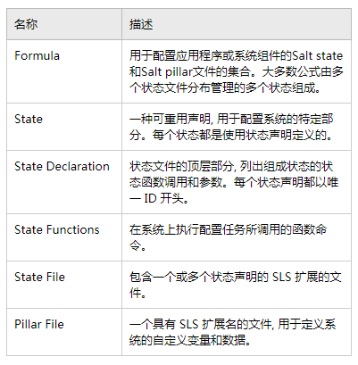
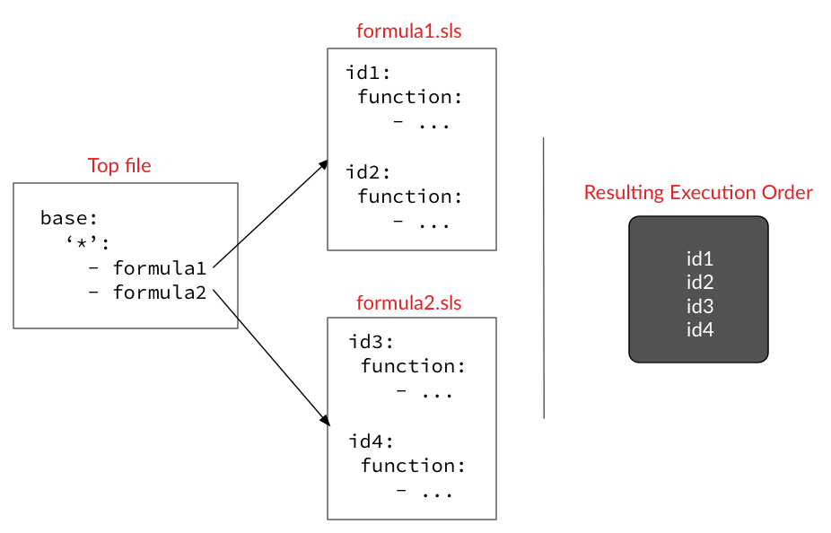
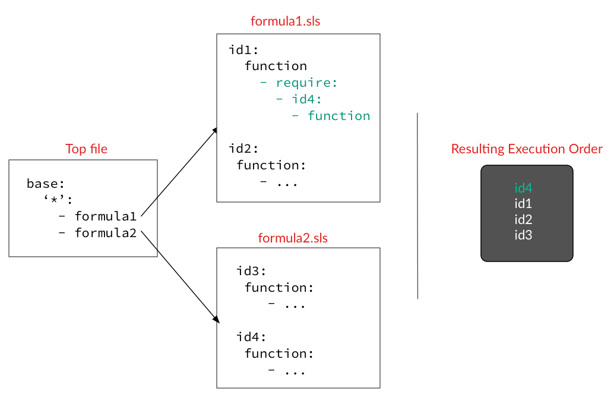
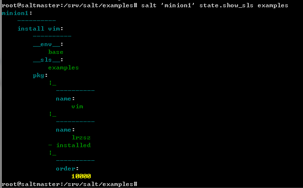
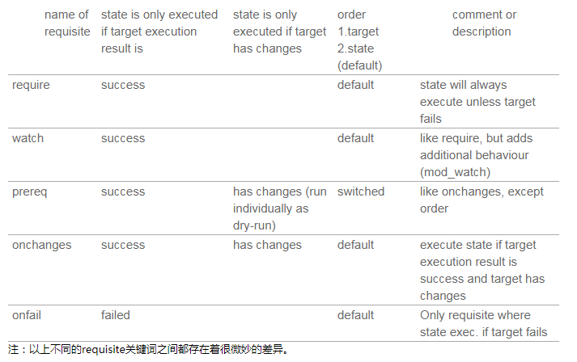
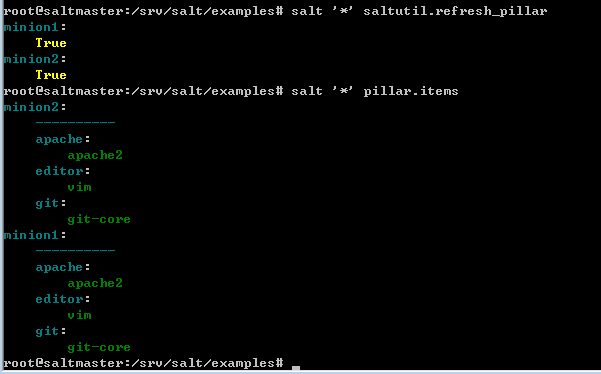

# 02-3.Configuration Management-配置管理
1. [Function—State函数&Execution函数](#function——state函数&execution函数)
2. [Pillar 系统的自定义变量和数据](#pillar系统的自定义变量和数据)
3. [INCLUDES](#includes)
4. [执行顺序&执行的先决条件](#执行顺序&执行的先决条件)
5. [JINJA](#jinja)
6. [文件管理](#文件管理)

本指南将指导您了解SaltStack配置管理功能的基本知识。
本指南建立在上一章节介绍的几个基础概念之上，并解释了Salt State函数调用、includes、requisites和Jinja等重要概念。

SaltStack的配置管理系统允许您为指定的系统上的应用程序、文件和其他设置的定义配置的“状态”。 系统将根据定义的配置持续进行评估，并根据需要进行更改。
# Function——State函数&Execution函数
现在让我们深入了解并了解有关Salt state功能的更多信息。
## SALT STATE 函数
Salt State函数是在Salt states模块下工作的，并且是使用SaltStack配置管理系统时最重要的事情。
可以使用该函数来安装和配置应用程序、创建用户、分发文件以及设置系统，以及可能需要执行的其他任何操作。
在我们调用任何函数之前，让我们看一下Salt states如何表示以及Salt state函数调用的语法。

## 语法
Salt states使用YAML来描述，YAML是描述结构化数据的简单语言（与JSON类似，但更加人性化）。
下图显示了Salt state声明的格式：


Salt state状态声明中的第一行是ID。 ID的下方是您调用一个或多个Salt状态函数的地方。
- 带有ID和每个函数调用的行都以冒号（:)结束。
- 每个函数调用在ID下面缩进两个空格。
- 参数作为列表传递给每个函数。
- 每行包含函数参数的行都以两个空格缩进开头，然后是连字符，然后是一个额外的空格。
- 如果参数采用单个值，则名称和值位于由冒号和空格分隔的同一行中。
- 如果一个参数需要一个列表，则列表从下一行开始，并缩进两个空格。

## 功能示例
学习如何使用Salt状态函数的最佳方式是观摩示例。 为了查看这些实例，我们需要启动在SaltStack基础知识章节中设置的vagrant演示环境。

打开一个终端到salt-vagrant-demo-master目录并运行。 如果您需要进行复习或者您不再拥有Vagrant环境，请参阅SaltStack基础知识的演示环境部分。

在您的环境待启动就绪时，可以手动创建一个名为salt-vagrant-demo-master/saltstack/salt/examples.sls的文件，您可以使用该文件运行这些示例。

## 安装一个软件包
将以下代码片段复制到您创建的examples.sls文件中：
``` yaml
install vim:
  pkg.installed:
    - name: vim
```
当您的Vagrant环境启动后（您回到命令提示符处），ssh登录您的Salt master：
``` bash
vagrant ssh master
```
通过运行以下命令来应用examples.sls：
``` bash
vagrant@saltmaster:~$ sudo salt 'minion1' state.apply examples
minion1:
----------
          ID: install vim
    Function: pkg.installed
        Name: vim
      Result: True
     Comment: All specified packages are already installed
     Started: 15:57:36.095606
    Duration: 88.299 ms
     Changes:

Summary for minion1
------------
Succeeded: 1
Failed:    0
------------
Total states run:     1
Total run time:  88.299 ms
vagrant@saltmaster:~$
```
如果是删除一个软件包则这样定义：
``` yaml
remove vim:
  pkg.removed:
    - name: vim
```

您可以按照类似的流程来测试本节中的其他示例。 您可以每次替换examples.sls的内容，也可以为每个示例创建新的SLS文件。 如果您使用新文件，请确保更新state.apply调用以引用新名称。
``` bash
sudo salt '*' state.apply name-of-your-sls-file-with-no-extension
```
## 创建一个目录
``` yaml
create my_new_directory:
file.directory:
   - name: /opt/my_new_directory
   - user: root
   - group: root
   - mode: 755
```

本示例仅使用了少量可用的file.directory选项。 可以看看文档，并尝试添加更多。
## 运行一个服务
该状态确保服务在Salt minion服务器上运行：
``` yaml
Make sure the mysql service is running:
  service.running:
    - name: mysql
```
每个state状态声明都由状态ID标识。 状态ID必须是唯一的，并且可以包含空格和数字。 在前面的例子中，"Make sure the mysql service is running"就是一个有效的ID。

您可以在单个状态ID下添加多个Salt状态函数调用：
``` yaml
Install mysql and make sure the mysql service is running:
  pkg.installed:
    - name: mysql
  service.running:
    - name: mysql
```
## 在系统启动时自动启动一个指定的服务
请确保在调用函数时查看完整的参数列表，因为通过简单传递附加参数通常会提供很多功能。 通过将enable: True传递给service.running，SaltStack将确保每次系统启动时服务都会启动。
``` yaml
Make sure the mysql service is running and enable it to start at boot:
  service.running:
    - name: mysql
    - enable: True
```
## 下载一个Git仓库
每个函数都有一个"name"的默认参数。如果你没有指定这个参数值，那么Salt会默认使用state ID作为这个参数的值。在下面的例子中，"name"的值就是：https://github.com/saltstack/salt.git
``` yaml
https://github.com/saltstack/salt-bootstrap:
  git.latest:
    - rev: develop
    - target: /tmp/salt
```
由于需要多输入一些字符，所以直接使用ID作为名称容易得到有经验的用户的欢迎。 你也可以这样写下这个状态：
``` yaml
Clone the SaltStack bootstrap script repo:
  pkg.installed:
    - name: git # make sure git is installed first!
  git.latest:
    - name:https://github.com/saltstack/salt-bootstrap
    - rev: develop
    - target: /tmp/salt
```
我们建议使用第二种格式并始终定义name参数。 该ID应该描述该state正在做什么，即使它可能需要更多的输入。 遵循这种格式往往会使您的state状态更加一致并且更易于重用、维护和调试。
## 增加用户
``` yaml
user account for pete:
  user.present:
    - name: pete
    - shell: /bin/bash
    - home: /home/pete
    - groups:
      - sudo
```
groups参数是一个列表，所以它在下一行，缩进两个空格，并在前面加一个破折号。
## 在hosts文件中增加一条记录
``` yaml
myserver in hosts file:
  host.present:
    - name: myserver
    - ip: 192.168.0.42
```
这是平台标准化的一个很好的例子。 即使不同主机以不同的方式配置hosts记录，这种state状态也可以直接应用于多个平台（Salt可以计算出细节，因此您不必担心）。
## 调用一个执行函数
service.restart和其他执行函数都可以在Salt状态中调用。
``` yaml
restart vsftpd:
  module.run:
    - name: service.restart
    - m_name: vsftpd  # m_name gets passed to the execution module as "name"
```
执行函数（简称“远程执行函数”）是您从salt命令行调用的命令，它们以salt.module.*开头。

注：执行函数以module.*开头，那是因为它们是Salt初始版本中的第一个也是唯一的模块，如果Salt被重写，我们可能应该改为以execution.*开始。
## 更多的关于Salt的Execution和Salt State的功能
您可能想知道为什么您要使用服务执行函数而不是服务state状态函数，以及Salt State和Salt Execution 函数之间似乎有很多重叠的功能。

如果将Salt Execution函数的名称（如service.restart）与类似的Salt State状态函数（如service.running）进行比较，您可能会注意到一个小的但重要的区别。Salt State状态功能旨在仅进行必要的更改以应用配置，否则不进行更改。 Salt执行函数则每次被调用时都会执行，它可能会导致或不会导致系统更改。

当您调用service.running状态函数时，该函数首先检查服务是否已经运行，并且只在需要时才启动它。当你调用service.restart执行函数时，服务总是会被重新启动，无论当前是否已经在运行中。

在很多情况下，Salt状态函数是通过包装Salt执行函数来实现的，但添加了额外的代码以帮助确定是否需要真的调用执行函数。

## test=True
应用Salt state状态可能会导致目标系统发生许多更改。 Salt state状态函数提供了一种机制来显示在实时运行期间所做的更改。 返回信息将以黄色显示应用会被变更的状态信息，并将结果报告为无。
``` bash
sudo salt 'minion1' state.apply examples test=True
```
我们对示例文件examples.sls变更了一点内容，改为同时安装vim lrzsz这两个软件后，执行test=True后的效果如下所示：



## init.sls
如果您在执行state.apply时或在state的Top文件中指定了状态文件的目录，则salt会在该目录中查找init.sls文件并应用它。
我们上面的示例中examples.sls如果改为这种定义方式的话，可以是下面这样：



以上就是这里要介绍的关于Salt state的部分知识.

你可以从这一点继续前进, 创建一个广泛的各种非常有用的Salt state状态, 然后使用Salt 状态函数调用它。Salt State具有数以百计的各类函数, 可以管理各种应用程序和服务。

SaltStack 的配置管理系统中的其余功能使您可以使用变量和循环来充分利用state状态, 并在失败时按分支进行处理, 支持使用语句 (如 "包含" 和 "要求") 来声明状态。掌握这些高级概念将帮助您从 SaltStack 的配置管理系统中获得最大的价值。
我们将在其余部分讨论这些功能。

## 术语



- FUNCTION DOCS

Salt state函数文档是找到可使用函数和参数的最佳资源 (Salt state函数以salt.states.*开头)。
- VAGRANT SHARED FOLDERS

为了简化事情, 我们的vagrant文件将你的Salt Master的/srv/salt目录映射到当地的salt-vagrant-demo-master/saltstack 目录。这意味着您可以使用本地文本编辑器并将文件保存到本地文件系统, 而Vagrant使它看起来就像是在Salt Master上一样。

# Pillar系统的自定义变量和数据
Salt Pillar是使Salt state可重复使用的必不可少的成分, 所以我们需要先从写Salt state的状态文件来设置它。

## Salt Pillar TOP FILE
Salt Pillar使用top file文件将Salt Pillar数据与Salt Minions配对。这个top file文件非常像Salt State用来匹配State与Salt minions的top file。

与Salt state 函数一样, 最好是通过一个例子来学习Salt Pillar。创建salt-vagrant-demo-master/saltstack/pillar目录, 然后创建一个名为 top.sls 的新文件。添加以下内容:
``` yaml
base:
  '*':
    - default
```
接下来, 在同一个目录中创建一个名为default.sls的文件，并添加以下内容:
``` yaml
# Default pillar values
editor: vim
```
当Salt Pillar数据更新时, 每个Salt Minions都与top.sls 文件中列出的目标匹配。当一个Salt Minion与目标匹配上时, 它会接受在该目标下方列表中定义的所有Salt Pillar SLS文件。很简单, 对吧？

由于我们的 * 通配符与所有的Salt Minions匹配, 每个Salt minion都收到默认的一个关于默认编辑器的pillar key的值的，即"vim"。

## 更新SALT PILLAR
我们将使用我们刚刚配置的Salt Pillar变更, 所以让我们先刷新一下所有minions的Salt pillar数据:
``` yaml
root@saltmaster:~# salt '*' saltutil.refresh_pillar
minion1:
    True
minion2:
    True
root@saltmaster:~#
```
## 在Salt States中使用Salt Pillar
Salt Pillar中定义的键值可以在Salt States中作为字典变量使用, 因此您现在可以对上一章节中的示例examples.sls做些调整，以使用此Salt Pillar键值:
``` yaml
install vim:
  pkg.installed:
    - name: {{ pillar['editor'] }}
    - name: lrzsz
```
Salt Pillar数据是加密传输的, 所以你可以用它来保存你准备用于Salt States的部分密码信息。例如, 可以添加以下key:value项对到Salt pillar:
``` yaml
ftpusername: me
ftppassword: oxfm4@8t5gglu^h^&
```
然后就可以在Salt state中引用它们了：
``` yaml
sync directory using lftp:
  cmd.run:
    - name: lftp -c "open -u {{ pillar['ftpusername'] }},{{ pillar['ftppassword'] }}
           -p 22 sftp://example.com;mirror -c -R /local /remote"
```
## 在命令行中调用Salt Pillar
对于测试或临时管理需要, 您可以直接在命令行上定义和引用 Salt Pillar的变量值。如果这些key也在 Salt Pillar文件中设置了，那么它们将会被覆盖掉。
``` bash
salt '*' state.apply ftpsync pillar='{"ftpusername": "test", "ftppassword": "0ydyfww3giq8"}'
```
## Salt Pillar可以自定义Salt State的几乎任何部分
希望这可以帮助您清楚地了解如何定制几乎是你的Salt State状态文件中任何需要使用到的值。

例如, 您可以创建 prodftp.sls 和 stageftp.sls Salt Pillar文件, 然后将不同的凭据插入到每个文件中, 然后针对不同的系统分别使用每个文件。虽然是将同一个Salt State状态文件应用于每个Minion系统, 但根据收到的Salt Pillar文件会使用不同的用户名和密码。

## 其他知识
**SALT PILLAR**

Salt pillar是这样的一种系统, 它允许您安全的定义一些数据，然后通过目标匹配方式应用到一个或多个minions中去。Salt Pillar数据可以用来存放端口、文件路径、配置参数和密码等值。

**{{ }} 是什么**

大括号内的值是 Jinja2 语句和表达式。我们将在本指南后面讨论 Jinja2。

**PILLAR.GET**

pillar.get也可用于检索Salt states中的pillar数据。这个函数要比访问 pillar 字典复杂得多, 但是它有一些增强功能, 使它成为更好的选择。

# INCLUDES
**关于SALT STATE TREES**

Salt state文件被组织成目录树的结构, 称为Salt state tree, 位于/srv/salt/目录中。您创建的任何新states状态文件都应放在此目录中。要更改此位置，需要设置/etc/salt/master中的file_roots参数。

为了保持您的 salt states状态模块化和可重用性, 每个配置任务只应在 Salt state状态树中描述一次。如果需要在多个位置使用相同的配置任务, 可以使用include功能。
使用include很简单。在state状态文件的顶部 (任何 ID 之外), 请使用以下格式添加include:
``` yaml
include:
  - sls1
  - sls2
```
其中 sls1 和 sls2 是要include的 SLS 文件的名称。请注意, 您不需要包含.sls 扩展名。
如果要包含的 salt 状态文件位于 salt 状态树中的子目录中, 请使用点 (.) 作为目录分隔符:
``` yaml
include:
  - dir.sls1
```
通过include进来的Salt states状态会插入到当前文件的顶部, 被首先处理。

**示例**

记得本指南前面的使用过的这个Salt state例子吗？
``` yaml
sync directory using lftp:
  cmd.run:
    - name: lftp -c "open -u {{ pillar['ftpusername'] }},{{ pillar['ftppassword'] }}
           -p 22 sftp://example.com;mirror -c -R /local /remote"
```
此Salt state状态取决于 lftp 可执行文件, 因此, 创建另一个 salt 状态以确保安装了 lftp 可能是一个好主意。然后, 我们可以使用include来组合两个状态。

srv/salt/lftp.sls:
``` yaml
install lftp:
  pkg.installed:
    - name: lftp
```
srv/salt/dir-sync.sls:
``` yaml
include:
  - lftp

sync directory using lftp:
  cmd.run:
    - name: lftp -c "open -u {{ pillar['ftpusername'] }},{{ pillar['ftppassword'] }}
           -p 22 sftp://example.com;mirror -c -R /local /remote"
```
使用include的优点是您可以使用 lftp.sls 在别处实现安装 lftp 而不必同步这些目录。

**为什么不使用TOP FILE来实现INCLUDE？**

与其在一个Salt state中include另一个，像下面这样：
``` yaml
include:
  - sls1

install a useful package:
  pkg.installed:
    - name: cowsay
```
你还有另外一种选择，把他们自己的Salt state文件和需要include进来的状态文件都放在top file中：
``` yaml
base:
  'web*':
    - sls1
    - sls2
```
如果Salt state状态总是需要其他状态, 那么使用include是一个更好的选择。如果只有某些系统应同时接收这两个 Salt 状态, 在top file文件中包括这两个状态, 您就可以灵活地决定哪个minion接收每个系统的哪一项。

# 执行顺序&执行的先决条件
## 声明性和强制性
SaltStack 支持两种主要方法来定义系统配置。
- 使用 SaltStack 强大的先决条件管理系统的声明性方法
- 或者使用 SaltStacks 内置的有序执行命令的管理方法。

## ORDERING 执行顺序
配置管理中最重要 (也是最复杂) 的方面之一是确保每个任务在正确的时间执行。

默认情况下, Salt 状态文件中的每个 ID 都按它在文件中显示的先后顺序执行。此外, 在top file文件中, 每个 Salt 状态文件都按列出的先后顺序得被应用。

例如, 下图中的状态 id 以数字顺序的次序运行, 而这是由于按这个顺序组织了top file文件和 Salt 状态文件:



通过组织您需要按此顺序应用的 Salt 状态, 就可以在不显式定义依赖项的情况下控制执行顺序。

## REQUISITES 执行的先决条件
Requisites 先决条件允许您在状态文件中显式指定 ID 的依赖项。如下所示，如果添加指示 id1 需要依赖于 id4 的语句, 则会先应用 id4。


您可以使用state.show_sls 执行函数来查看应用Salt states状态的顺序。例如:
``` bash
salt 'minion1' state.show_sls sls1[,sls2,...]
```
查看前面的examples.sls示例中应用 Salt 状态的顺序:


## BEYOND REQUIRE
还可以使用其他几种语句声明方式来控制执行顺序。您可以在[Requisites and other Global State Arguments](https://docs.saltstack.com/en/latest/ref/states/requisites.html)中找到详细信息。

## REQUISITE 概览


## DIRECT REQUISITE AND REQUISITE_IN TYPES
可以在Salt中使用的direct requisite statements:
- require
- watch
- prereq
- use
- onchanges
- onfail

每一个 direct requisite 都有一个相关联的 requisite_in形式:
- require_in
- watch_in
- prereq_in
- use_in
- onchanges_in
- onfail_in

这里还有几个在2018.3版本中新增的requisite_any statements:
- require_any
- watch_any
- onchanges_any
- onfail_any

require_any，意味着会声明对多个资源有依赖关系，只要满足其一，就认为是符合依赖关系要求的了。

# JINJA
salt 包括 Jinja2 模板引擎, 可用于Salt state文件、Salt pillar文件和由Salt管理的其他文件。
Jinja2被广泛使用，Jinja2文档中有更多的细节。
Salt允许你使用Jinja来访问minion配置值，grain和Salt pillar数据，并且调用Salt执行模块。 这是对Jinja中已有的标准控制结构和Python数据类型的补充。

## 条件语句

Jinja最常见的用途之一是将条件语句插入到Salt pillar文件中。

由于许多发行版都有不同的软件包名称，因此可以使用os grain来设置特定于平台的路径，软件包名称和其他值。
例如：
``` yaml
apache: httpd
git: git
apache: apache2
git: git-core

```
正如你所看到的，Salt grains可以像Salt pillar一样用在字典变量中。 此示例检查Salt grains值以设置操作系统特定的Salt pillar keys。

将上面的代码片段保存到saltstack/pillar/common.sls文件中，然后运行以下命令来刷新并列出每个minion的Salt pillar 变量值：
``` bash
salt '*' saltutil.refresh_pillar
salt '*' pillar.items
```


设置这些值后，当您应用以下Salt状态时：
``` yaml
install apache:
  pkg.installed:
    - name: {{ pillar['apache'] }}
```
httpd软件包会安装在RedHat上，而apache2软件包安装在Debian上。

## 循环语句
循环对于在Salt状态下创建用户和文件夹非常有用。
``` yaml

{{ usr }}:
  user.present

```
``` yaml

{{ DIR }}:
  file.directory:
    - user: root
    - group: root
    - mode: 774

```
一般来说，你应该尽量保持你的Salt状态尽可能简单。 如果你发现自己编写复杂的Jinja，你应该考虑把任务分解成多个Salt状态，或者为这个任务编写一个自定义的Salt执行模块（这比听起来容易，特别是如果你知道一些Python！）。

## 使用Salt获取数据
你可以在Jinja中调用Salt执行函数来获取系统的实时数据。
``` yaml
{{ salt.cmd.run('whoami') }}
```

# 文件管理
## 文件模板
Salt允许您使用模板和变量管理文件。 查看[salt.states.file](https://docs.saltstack.com/en/latest/ref/states/all/salt.states.file.html)文档以了解更多信息。

## GIT FILESERVER
许多组织将其所有配置和资源文件存储在源代码管理中以进行更改跟踪。 Salt允许您使用Git repo作为文件服务器，而不是使用Salt master服务器上的本地文件系统（或除此之外），以大大简化此工作流程。

例如，如果您的http.conf是在Git仓库中进行版本管理的，则每次提交更改时，所有目标系统都会在下次运行file.managed Salt状态时收到更改。

请参阅[Git Fileserver](https://docs.saltstack.com/en/latest/topics/tutorials/gitfs.html#git-fileserver-backend-walkthrough)后端实践，了解如何将您自己的Git repo设置为Salt文件服务器后端。

在系统上获取正确的文件通常比安装正确的软件更具挑战性。 Salt有一个内置的文件服务器，可以将文件和文件夹传送到受管系统。

## SALT://
您很熟悉将Salt状态文件放置在srv/salt目录中，但您可能不知道的是您放置在此目录中的任何其他文件和文件夹也可用于您的Salt minions来访问它们。 您可以使用salt://URL，然后是相对于srv/salt目录的文件路径，在Salt状态中引用这些文件。

## FILE.MANAGED
通过Salt状态函数，您可以通过在Salt master指定源文件来管控minions本地文件。
``` yaml
deploy the http.conf file:
  file.managed:
    - name: /etc/http/conf/http.conf
    - source:salt://apache/http.conf
```
由于源路径以salt://开头，因此我们可以确定此文件的源是我们的Salt master节点上的/srv/salt/apache/http.conf。

Salt每次应用Salt状态时，都会确保本地文件与服务器上的版本相匹配。 这有助于防止配置漂移，并有助于确保应用程序在不同系统上的配置相同。

例如，如果要为lftp分发全局配置文件，其中包含限制下载速率的自定义设置，则可以使用file.managed执行此操作：
``` yaml
install network packages:
  pkg.installed:
    - pkgs:
      - rsync
      - lftp
      - curl

copy lftp config file:
  file.managed:
    - name: /etc/lftp.conf
    - source: salt://_tmpl_lftp.conf
```
另一种选择是，如果我们的配置更改是单行的，所以使用file.append来插入我们想要添加的新行：
``` yaml
install network packages:
  pkg.installed:
    - pkgs:
      - rsync
      - lftp
      - curl

update lftp conf:
  file.append:
    - name: /etc/lftp.conf
    - text: set net:limit-rate 100000:500000
```

## FILE.RECURSE
这个Salt状态函数将会复制整个目录。
``` yaml
copy some files to the web server:
  file.recurse:
    - name: /var/www
    - source:salt://apache/www
```

小结
您现在应该对SaltStack的配置管理系统有更好的了解，并有足够的知识开始编写自己的Salt状态。 如果您正在寻找灵感，[SaltStack Formula Repo](https://github.com/saltstack-formulas)包含许多示例。
