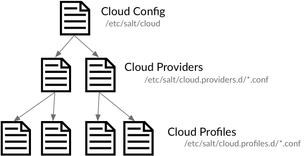

# Salt Cloud

在云主机/虚拟机上执行系统配置任务，使其可以接受统一的配置管理。

## Configuration - 配置文件

Salt Cloud提供了与云主机交互的强大接口。 该接口与Salt紧密集成，新虚拟机在创建后将自动连接到Salt master。

由于Salt Cloud被设计为自动化的系统，因此大多数配置使用以下YAML配置文件完成：
 - `/etc/salt/cloud`：主要的配置文件，包含适用于所有云主机宿主机的全局设置。请参阅 [Salt Cloud Configuration](https://github.com/watermelonbig/SaltStack-Chinese-ManualBook/blob/master/chapter15/15-3.Salt-Cloud-Core-Configuration.md)。
 - `/etc/salt/cloud.providers.d/*.conf`：包含用于配置特定云主机宿主机的设置，例如凭据、区域设置等。由于每个云主机宿主机之间的配置差异很大，因此应为每个云主机宿主机创建一个单独的文件。在Salt Cloud中，提供者与云主机宿主机（Amazon EC2，Google Compute Engine，Rackspace等）同义。请参阅 [Provider Specifics](https://docs.saltstack.com/en/latest/topics/cloud/index.html#cloud-provider-specifics)。
 - `/etc/salt/cloud.profiles.d/*.conf`：包含定义特定云主机宿主机类型的设置。Profile配置文件定义系统规格和映像以及特定于此VM类型的任何其他设置。每种特定的VM类型称为一个profile配置文件，允许在一个profile配置文件中定义多个profiles配置文件。每个profile配置文件都引用一个父provider程序，该provider程序定义了在其中创建VM的云主机宿主机（Provider程序设置在上面解释的provider程序配置中有做说明）。根据您的需要，您可以为Web服务器、数据库服务器等定义不同的profiles配置文件。请参阅 [VM Profiles](#Cloud-Provider-Specifics)。

## Configuration Inheritance - 配置的继承

配置设置是按顺序从cloud config => provider => profile配置文件依次继承的。

例如，如果要为特定provider将所有虚拟机使用相同的映像，则可以将映像名称放在provider配置文件中。 使用该provider的所有配置文件都将继承此值，但是如果在profile配置文件中定义了映像名称，则该值将被覆盖。

可以在任何文件中定义大多数的配置设置，主要区别在于该设置的继承方式。

## QuickStart - 快速入门

Salt Cloud[快速入门](https://github.com/watermelonbig/SaltStack-Chinese-ManualBook/blob/master/chapter15/15-1.Salt-Cloud-QuickStart.md)将引导您定义一个provider、定义VM profile配置文件，并向您展示如何使用Salt Cloud创建虚拟机。

请注意，如果您是通过[Salt Bootstrap](https://github.com/watermelonbig/SaltStack-Chinese-ManualBook/blob/master/chapter03/03-3.Additional-Installation-Guides-补充安装说明.md)安装Salt的，则可能没有为您自动安装`salt-cloud`。 使用发行版的软件包管理器从用于安装Salt的同一存储库中安装`salt-cloud`软件包。 这些存储库将由Salt Bootstrap自动设置。

或者，可以在安装Salt时将`-L`选项传递给Salt Bootstrap脚本。 `-L`选项将安装salt-cloud和所需的libcloud软件包。

## [Using Salt cloud - Salt cloud模块使用指南](https://github.com/watermelonbig/SaltStack-Chinese-ManualBook/blob/master/chapter15/15-2.Using-Salt-Cloud.md)
 - [salt-cloud Command Line Reference - salt-cloud命令使用说明](https://github.com/watermelonbig/SaltStack-Chinese-ManualBook/blob/master/chapter15/15-2.Using-Salt-Cloud.md#salt-cloud-Command-Line-Reference---salt-cloud命令使用说明)
 - [Salt Cloud basic usage - Salt Cloud的基本用法](https://github.com/watermelonbig/SaltStack-Chinese-ManualBook/blob/master/chapter15/15-2.Using-Salt-Cloud.md#Salt-Cloud-basic-usage---Salt-Cloud的基本用法)
 - [VM Profiles - 定义虚机的配置文件](https://github.com/watermelonbig/SaltStack-Chinese-ManualBook/blob/master/chapter15/15-2.Using-Salt-Cloud.md#VM-Profiles---定义虚机的配置文件)
 - [Cloud Map File - 云管理的映射文件](https://github.com/watermelonbig/SaltStack-Chinese-ManualBook/blob/master/chapter15/15-2.Using-Salt-Cloud.md#Cloud-Map-File---云管理的映射文件)
 - [Cloud Actions - 云管理的操作命令](https://github.com/watermelonbig/SaltStack-Chinese-ManualBook/blob/master/chapter15/15-2.Using-Salt-Cloud.md#Cloud-Actions---云管理的操作命令)
 - [Cloud Functions - 云管理的功能函数](https://github.com/watermelonbig/SaltStack-Chinese-ManualBook/blob/master/chapter15/15-2.Using-Salt-Cloud.md#Cloud-Functions---云管理的功能函数)

## [Install Salt Cloud - 安装Salt Cloud](https://github.com/watermelonbig/SaltStack-Chinese-ManualBook/blob/master/chapter15/15-3.Salt-Cloud-Core-Configuration.md#Install-Salt-Cloud---安装Salt-Cloud)
## [Core Configuration - 核心配置](https://github.com/watermelonbig/SaltStack-Chinese-ManualBook/blob/master/chapter15/15-3.Salt-Cloud-Core-Configuration.md#Core-Configuration---核心配置)
 - [Thread Pool Size](https://github.com/watermelonbig/SaltStack-Chinese-ManualBook/blob/master/chapter15/15-3.Salt-Cloud-Core-Configuration.md#Thread-Pool-Size)
 - [Minion Configuration](https://github.com/watermelonbig/SaltStack-Chinese-ManualBook/blob/master/chapter15/15-3.Salt-Cloud-Core-Configuration.md#Minion-Configuration)
 - [Cloud Configuration Syntax](https://github.com/watermelonbig/SaltStack-Chinese-ManualBook/blob/master/chapter15/15-3.Salt-Cloud-Core-Configuration.md#Cloud-Configuration-Syntax)
 - [Pillar Configuration](https://github.com/watermelonbig/SaltStack-Chinese-ManualBook/blob/master/chapter15/15-3.Salt-Cloud-Core-Configuration.md#Pillar-Configuration)
 - [Cloud Configurations](https://github.com/watermelonbig/SaltStack-Chinese-ManualBook/blob/master/chapter15/15-3.Salt-Cloud-Core-Configuration.md#Cloud-Configurations)
 - [Extending Profiles and Cloud Providers Configuration](https://github.com/watermelonbig/SaltStack-Chinese-ManualBook/blob/master/chapter15/15-3.Salt-Cloud-Core-Configuration.md#Extending-Profiles-and-Cloud-Providers-Configuration)

## [Windows Configuration - 怎样使用Salt Cloud管理Windows实例](https://github.com/watermelonbig/SaltStack-Chinese-ManualBook/blob/master/chapter15/15-4.Salt-Cloud-Windows-Configuration.md)
 - [Requirements](https://github.com/watermelonbig/SaltStack-Chinese-ManualBook/blob/master/chapter15/15-4.Salt-Cloud-Windows-Configuration.md#Requirements)
 - [Self Signed Certificates with WinRM](https://github.com/watermelonbig/SaltStack-Chinese-ManualBook/blob/master/chapter15/15-4.Salt-Cloud-Windows-Configuration.md#Self-Signed-Certificates-with-WinRM)
 - [Firewall Settings](https://github.com/watermelonbig/SaltStack-Chinese-ManualBook/blob/master/chapter15/15-4.Salt-Cloud-Windows-Configuration.md#Firewall-Settings)
 - [Configuration](https://github.com/watermelonbig/SaltStack-Chinese-ManualBook/blob/master/chapter15/15-4.Salt-Cloud-Windows-Configuration.md#Configuration)
 - [Auto Generated Passwords on EC2](https://github.com/watermelonbig/SaltStack-Chinese-ManualBook/blob/master/chapter15/15-4.Salt-Cloud-Windows-Configuration.md#Auto-Generated-Passwords-on-EC2)

## [Cloud Provider Specifics - 针对特定云平台的Salt Cloud配置方法](https://github.com/watermelonbig/SaltStack-Chinese-ManualBook/blob/master/15.Salt-Cloud.md#Cloud-Provider-Specifics---针对特定云平台的Salt-Cloud配置方法)
 - [Getting Started With Aliyun - 阿里云入门](https://github.com/watermelonbig/SaltStack-Chinese-ManualBook/blob/master/chapter15/15-5.Salt-Cloud-Getting-Started-With-Aliyun.md)
 - [Getting Started With Azure - Azure入门](https://github.com/watermelonbig/SaltStack-Chinese-ManualBook/blob/master/chapter15/15-6.Salt-Cloud-Getting-Started-With-Azure.md)
 - [Getting Started With Azure Arm - Azure Arm入门](https://github.com/watermelonbig/SaltStack-Chinese-ManualBook/blob/master/chapter15/15-7.Salt-Cloud-Getting-Started-With-Azure-Arm.md)
 - [Getting Started With CloudStack - CloudStack入门](https://github.com/watermelonbig/SaltStack-Chinese-ManualBook/blob/master/chapter15/15-8.Salt-Cloud-Getting-Started-With-CloudStack.md)
 - [Getting Started With DigitalOcean - DigitalOcean入门](https://github.com/watermelonbig/SaltStack-Chinese-ManualBook/blob/master/chapter15/15-9.Salt-Cloud-Getting-Started-With-DigitalOcean.md)
 - [Getting Started With Dimension Data - Dimension Data入门](https://github.com/watermelonbig/SaltStack-Chinese-ManualBook/blob/master/chapter15/15-10.Salt-Cloud-Getting-Started-With-Dimension-Data.md)
 - [Getting Started With EC2 - EC2入门](https://github.com/watermelonbig/SaltStack-Chinese-ManualBook/blob/master/chapter15/15-11.Salt-Cloud-Getting-Started-With-EC2.md)
 - [Getting Started With EC2 - GoGrid入门](https://github.com/watermelonbig/SaltStack-Chinese-ManualBook/blob/master/chapter15/15-12.Salt-Cloud-Getting-Started-With-GoGrid.md)
 - [Getting Started With Google Compute Engine - Google Compute Engine入门](https://github.com/watermelonbig/SaltStack-Chinese-ManualBook/blob/master/chapter15/15-13.Salt-Cloud-Getting-Started-With-Google-Compute-Engine.md)
 - [Getting Started With HP Cloud - HP Cloud入门](https://github.com/watermelonbig/SaltStack-Chinese-ManualBook/blob/master/chapter15/15-14.Salt-Cloud-Getting-Started-With-HP-Cloud.md)
 - [Getting Started With Joyent - Joyent入门](https://github.com/watermelonbig/SaltStack-Chinese-ManualBook/blob/master/chapter15/15-15.Salt-Cloud-Getting-Started-With-Joyent.md)
 - [Getting Started With Libvirt - Libvirt入门](https://github.com/watermelonbig/SaltStack-Chinese-ManualBook/blob/master/chapter15/15-16.Salt-Cloud-Getting-Started-With-Libvirt.md)
 - [Getting Started With Linode - Linode入门](https://github.com/watermelonbig/SaltStack-Chinese-ManualBook/blob/master/chapter15/15-17.Salt-Cloud-Getting-Started-With-Linode.md)
 - [Getting Started With LXC - LXC入门](https://github.com/watermelonbig/SaltStack-Chinese-ManualBook/blob/master/chapter15/15-18.Salt-Cloud-Getting-Started-With-LXC.md)
 - [Getting Started With OneAndOne - OneAndOne入门](https://github.com/watermelonbig/SaltStack-Chinese-ManualBook/blob/master/chapter15/15-19.Salt-Cloud-Getting-Started-With-OneAndOne.md)
 - [Getting Started With OpenNebula - OpenNebula入门](https://github.com/watermelonbig/SaltStack-Chinese-ManualBook/blob/master/chapter15/15-20.Salt-Cloud-Getting-Started-With-OpenNebula.md)

https://docs.saltstack.com/en/latest/topics/cloud/index.html
